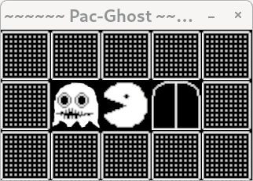
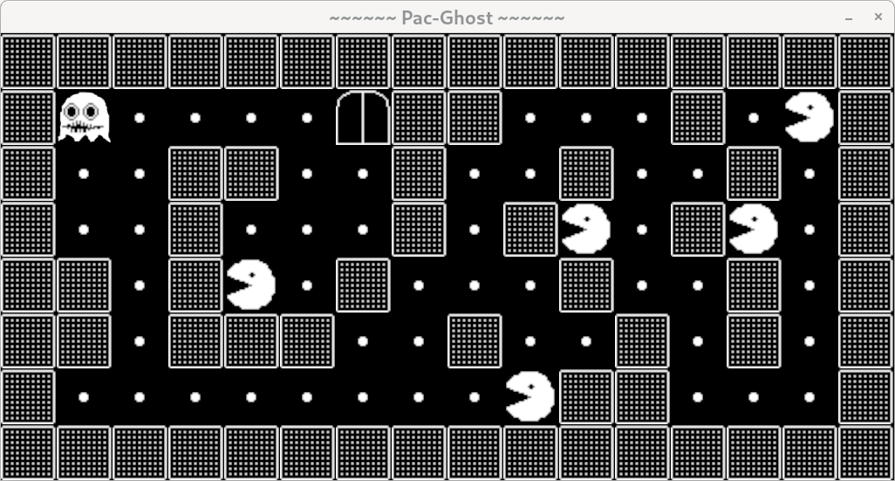
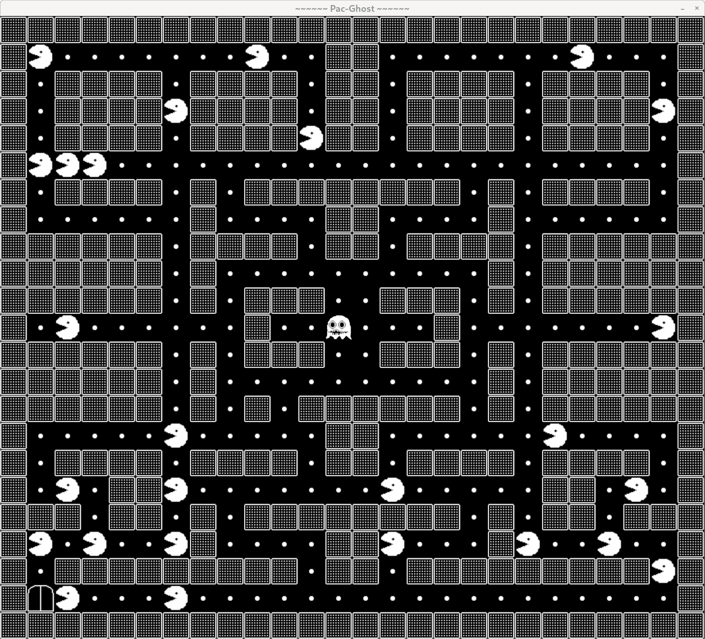
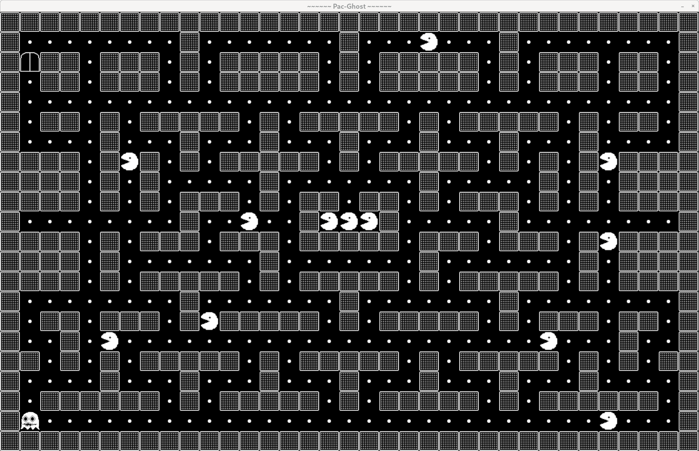
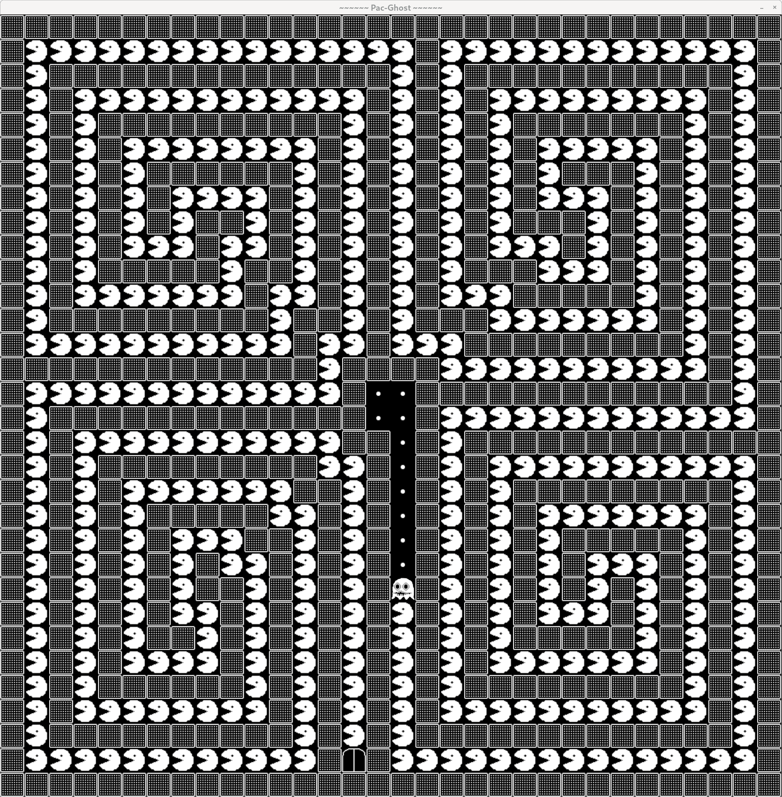
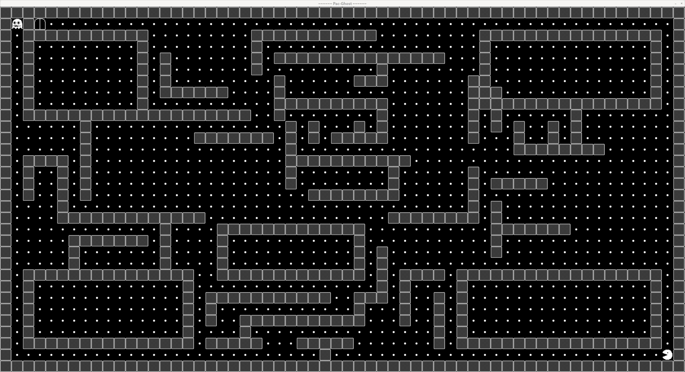

So_Long was developed as a part of the curriculum at HIVE Helsinki, a coding school affiliated with the 42 network of coding schools headquartered in Paris.

My implementation of the game uses the characters from Pac-Man but with reversed roles. In PAC-GHOST, the ghost is the main character and it has to kill as many Pac-Men as possible before leaving the maze through a staircase. 

To run it, copy all the files to a directore and run "make". The MLX42 library will be cloned in the process. Once compiled, the programme is run through the command './so_long maps/mapfile.ber'. Choose among the maps available in the 'maps' directory.

My project successfully passed evaluation by three human evaluators, achieving the final score of 100 points.


A tiny map for basic testing.


Average-sized map.


Pac-Man-inspired maze.


A big map.


Another big map.


The biggest possible map on a 3840 x 2160 display.
Bigger maps will return an error if one tries to run them.
This can be easily changed in the read_map() function in the file with the same name.

```
if (width > 60 || height > 32)
	handle_error("The map is too big.", game);
```
